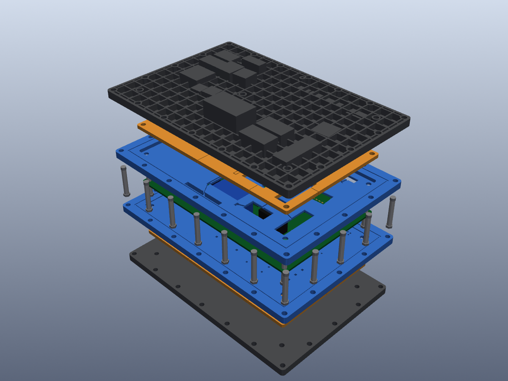

# SBC Designer

A Windows desktop application that loads a PCBA as a STEP file, shows it in 3D
(rotate, zoom, pan, view presets, exploded view), and generates the 3D-printable
parts of a **phase-1 Sandwich Circuit Board (SBC)** for either side of the PCB,
following the SCB project description, revision F, section 4.



## What it generates

Each part can be generated on its own, for the **top** side, the **bottom** side or
both. All parts come from one shared layout, so a part generated on its own still
fits the others.

| Part | Per side | What the generator builds |
|---|---|---|
| **Alignment layer** | yes | One *keyed pocket* per component, cut to that component's footprint (minimum-area rectangle of its outline), with **three datum pads** (two on a long wall, one on the adjacent short wall), a **chamfered lead-in** and a clearance on the other walls. It also gets plain pockets around the other side's through-hole leads, **air channels** notched into the top face (a minimum spanning tree linking every pocket to the getter and the port), **getter pockets** for the iron powder, a **pump-port well**, a **perimeter frame** that wraps the board edge and meets the other side's frame at the board mid-plane, **gasket grooves**, and compression-sleeve holes. |
| **Pressing layer** | yes | A **mosaic of tiles**. Polymer (PEEK/PEI) tiles have a U-cut **cantilever spring arm** for small parts, or a slotted **bridge** carrying a pressure pad for large ones. The boss at the tip sits 0.1 mm off centre towards the datum corner and has a preload interference. Parts that rise into the layer get **recesses**, and taller parts get cut-outs. Every power package (D-PAK, TO-220 and similar) gets a separate **aluminium tile with a thermal pad**. Tile split lines are chosen so that they miss arms, sleeves and metal tiles. |
| **Cover plate** (top plate / base plate) | yes | A ribbed plate: 1.2 mm skin, 5 mm ribs on a 10 mm pitch, a rim, **screw bosses**, a **sealed dome** over every component taller than the stack, and a **pump port** nipple. |
| **Screw grid** | shared | M2.5 screws with nuts on a pitch of 30 mm or less around the frame. Interior screws go through existing PCB holes (optionally on a 30 mm grid, which means drilling the PCB). Each side has **steel compression sleeves**, so the clamp path is metal from end to end. |

All dimensions are editable in **Design parameters…**, and you can save or load them
as JSON. Defaults: alignment layer 2.0 mm, pressing layer 3.0 mm, pocket clearance
0.15 mm, getter volume 0.7 mL (about 2 g of iron powder), frame width 14 mm.

The report panel lists the board size, the component count per side, the stack
height, the screws, and the pockets, arms, bridges, metal tiles and channels on each
side. It also lists design notes, such as parts that need a dome or where there is
no room for a spring arm.

### How the PCBA is interpreted
* The **board** is the thin plate in the model. A name containing "PCB" or
  "board" takes priority. The model is rotated so that the board lies in XY,
  whatever its orientation in the file.
* Each child of the STEP assembly is one **component**. It belongs to the side it
  extends furthest from. If it also protrudes on the other side (through-hole
  leads), each lead cluster becomes its own clearance pocket there.
* A component whose name contains a **power keyword** (D-PAK, TO-252, TO-220, …,
  editable) gets a metal tile.

## Demo
`demo/ac_controller_pcba.step` is an indoor-unit **air-conditioner controller**:
a 160 × 100 × 1.6 mm FR-4 board with 81 parts. It has a mains section (terminal
block, fuse, varistor, X2 capacitor, common-mode choke, bridge, 400 V bulk
capacitor, EE16 flyback transformer, off-line switcher, 7805 on D-PAK), a relay
section (30 A compressor relay, fan and four-way-valve relays, fan triac on a
D-PAK, ULN2003), and a low-voltage section (LQFP-48 MCU, crystal, LM358, buzzer,
JST sensor/stepper connectors, display header, LEDs, 0402 to 1206 passives).
The bottom side has an EEPROM, transistors and passives, plus the protruding
leads of every through-hole part. Use **File ▸ Load demo PCBA** (Ctrl+D). The
file is generated by `python -m sbc_designer.demo_pcba`.

## Using the viewer
| Action | Mouse | Keys |
|---|---|---|
| Rotate | left drag | Ctrl+arrows |
| Pan | Shift+left drag or middle drag | arrows |
| Zoom | wheel or right drag | + / − |
| Spin about the view axis | Ctrl+left drag | |
| Fit all / Iso / Top / Bottom / Front / Back / Left / Right | toolbar | F / 0 / 1–6 |
| Orthographic projection | toolbar | P |

The **Model** tree has a visibility check box for every PCBA part and every
generated part. The **Display** box has the explode slider and opacity sliders for
the PCBA and for the generated parts. Use **File ▸ Export checked generated parts…**
to write one STEP assembly, or **Export each generated part to folder…** to write
one STEP file per part and side.

## Install and run on Windows
Stand-alone build: download the `SBC_Designer-windows` artifact from the latest
**CI** run on GitHub (Actions tab), unzip it, and run `SBC_Designer.exe`.

From source (64-bit Python 3.10–3.12):
```bat
install_windows.bat        :: creates .venv and installs the dependencies
run_sbc_designer.bat       :: starts the application
build_windows_exe.bat      :: optional: builds dist\SBC_Designer\SBC_Designer.exe
```

Command line (batch generation without the GUI):
```bat
.venv\Scripts\python -m sbc_designer cli info demo\ac_controller_pcba.step
.venv\Scripts\python -m sbc_designer cli generate board.step --part alignment --side bottom -o bottom_alignment.step
.venv\Scripts\python -m sbc_designer cli generate board.step --all --out-dir parts
.venv\Scripts\python -m sbc_designer cli screenshot board.step --with-parts -o view.png
```

## Tests
```bat
.venv\Scripts\python -m pytest
```
There are 98 tests. They cover the 2D geometry (hull, rotated rectangles,
separating-axis overlap, MST), STEP round trips, PCBA analysis (including a board
stored standing on its edge), parameter validation, the stack layout, the geometry
of every generated part (pockets empty, datum pads solid, no collision with
components, bosses reaching their parts, hollow domes with solid roofs, port bores,
sleeve counts), the viewer camera operations, the command line, and the GUI
(pytest-qt). CI runs them on `windows-latest`, using Mesa for OpenGL, and on Ubuntu
under Xvfb, and then builds the Windows executable.

## Code layout
```
sbc_designer/
  app.py            Qt main window (viewer, model tree, design panel, parameters dialog)
  viewer.py         VTK scene: meshes, camera (view presets, zoom, pan, rotate), explode, screenshots
  step_io.py        STEP import (XCAF names/colours) and export
  pcba.py           board detection, canonical frame, per-side component footprints
  geometry2d.py     hull, min-area rectangle, overlap tests, MST
  design/params.py  design parameters with limits, JSON I/O
  design/layout.py  shared stack layout: z-levels, screws, pockets, arms, tiles, getter, port, channels
  design/generator.py  solid modelling of each part (OpenCASCADE via CadQuery)
  project.py        GUI-independent application state
  cli.py            command line
  demo_pcba.py      builder for the demo air-conditioner controller
```

## Limitations (phase 1 scope)
* Pockets follow each component's minimum-area rectangle, not its exact
  silhouette. Datum pads bear on the outermost extent of the part, which is the
  lead tips on gull-wing packages.
* Through-hole parts are enclosed (clearance pocket + sealed dome), but their
  electrical contact is not part of the SBC pressure-contact scheme.
* Spring-arm dimensions are geometric defaults. Sizing them for a 1.2 N preload
  (WP2) is left to the parameters.
